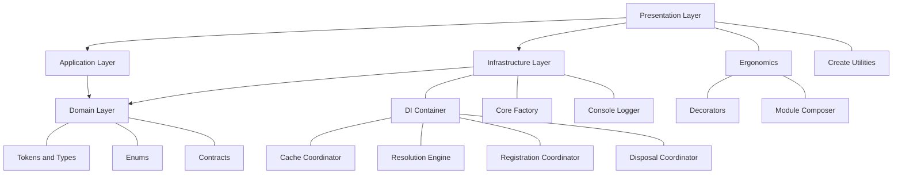
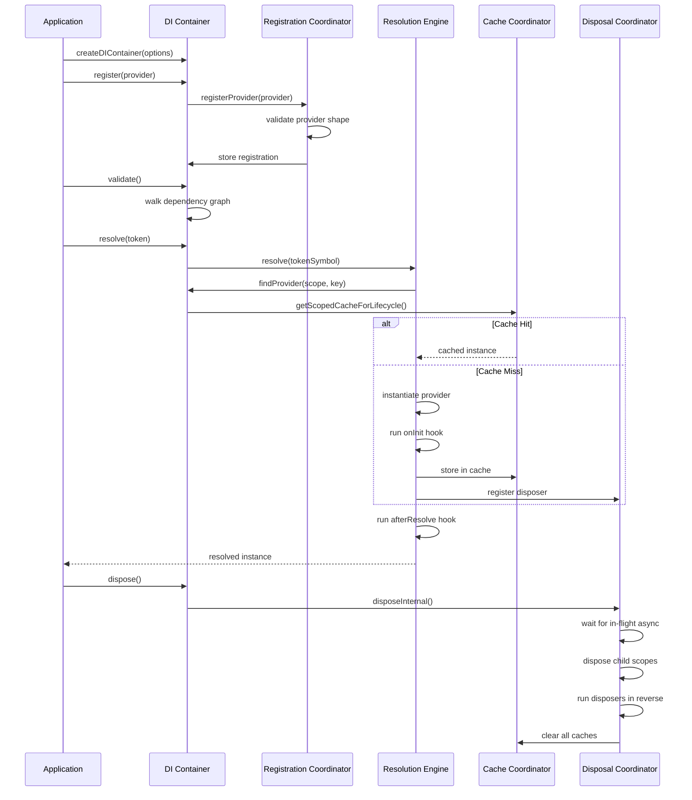

<a id="top"></a>

<p align="center">
  
</p>

<h1 align="center">🏗️ ClaDI</h1>
<p align="center"><em>A zero-dependency TypeScript dependency injection toolkit for composition-root architecture and clean, modular applications</em></p>

<p align="center">
    <a aria-label="ElsiKora logo" href="https://elsikora.com">
  
</a>        
</p>

## 💡 Highlights

- 🪶 Zero runtime dependencies — the entire DI container ships at minimal bundle cost with no transitive dependency risk
- 🔒 Fully type-safe tokens via `createToken<T>()` — dependency mismatches are caught at compile time, not runtime
- 🧩 Scope-aware lifecycles with deterministic disposal — singleton, scoped, and transient providers with automatic cleanup in correct order
- 🏛️ Clean Architecture native — domain and application layers never import DI APIs; only the composition root touches the container

## 📚 Table of Contents

- [Description](#-description)
- [Tech Stack](#-tech-stack)
- [Features](#-features)
- [Architecture](#-architecture)
- [Project Structure](#-project-structure)
- [Prerequisites](#-prerequisites)
- [Installation](#-installation)
- [Testing Toolkit](#-testing-toolkit)
- [Usage](#-usage)
- [API Quick Reference](#-api-quick-reference)
- [Production Bootstrap](#-production-bootstrap)
- [Common Pitfalls](#-common-pitfalls)
- [Roadmap](#-roadmap)
- [FAQ](#-faq)
- [License](#-license)
- [Acknowledgments](#-acknowledgments)

## 📖 Description

ClaDI (Class Dependency Injection) is a production-grade, zero-dependency TypeScript library that provides a complete dependency injection container with scope-aware lifecycles, typed tokens, and deterministic cleanup.

Unlike heavyweight DI frameworks that rely on decorators, reflection metadata, or runtime magic, ClaDI embraces **explicit composition roots** — giving you full control over how your dependency graph is assembled, resolved, and disposed.

### Real-World Use Cases

- **Backend Services**: Wire up HTTP handlers, database connections, and middleware with request-scoped isolation. Each incoming request gets its own scope with automatic cleanup.
- **CLI Tools**: Parse arguments, register them as scoped values, resolve command handlers, and dispose cleanly after execution.
- **Microservices**: Manage singleton adapters (database pools, message queues) alongside per-job transient workers with lifecycle guarantees.
- **Modular Monoliths**: Use the module system (`composeModules`) to define bounded contexts with explicit export contracts — no accidental cross-boundary coupling.
- **Testing**: Swap out any provider at any scope level without touching production code. The typed token system catches mismatches at compile time.

ClaDI ships with **5 provider strategies** (`useValue`, `useClass`, `useFactory`, `useExisting`, `useLazy`), **3 lifecycle modes** (`singleton`, `scoped`, `transient`), built-in **circular dependency detection**, **captive dependency warnings**, and full **async resolution** support — all in a package with zero runtime dependencies.

## 🛠️ Tech Stack

| Category            | Technologies                     |
| ------------------- | -------------------------------- |
| **Language**        | TypeScript                       |
| **Runtime**         | Node.js                          |
| **Build Tool**      | Rollup                           |
| **Testing**         | Vitest                           |
| **Linting**         | ESLint, Prettier                 |
| **CI/CD**           | GitHub Actions, Semantic Release |
| **Package Manager** | npm                              |
| **Documentation**   | MDX, Nextra                      |

## 🚀 Features

- ✨ **Typed Token System** — `createToken<T>()` produces branded symbols that carry type information through the entire resolution chain, eliminating `any` casts and runtime type errors
- ✨ **5 Provider Strategies** — `useValue`, `useClass`, `useFactory`, `useExisting` (alias), and `useLazy` (deferred async) cover common dependency wiring patterns
- ✨ **Scope-Aware Lifecycles** — Singleton (process-wide), Scoped (per-request/job), and Transient (per-resolve) with deterministic cache semantics
- ✨ **Hierarchical Scope Tree** — Child scopes inherit parent registrations, can add local overrides, and dispose independently without affecting siblings
- ✨ **Async Resolution Pipeline** — `resolveAsync()` handles async factories, deduplicates concurrent singleton creation, and tracks in-flight resolutions during disposal
- ✨ **Lifecycle Hooks** — `onInit`, `afterResolve`, and `onDispose` hooks per provider for warmup, instrumentation, and cleanup
- ✨ **Multi-Binding Support** — Register multiple implementations for a single token and resolve all with `resolveAll()` / `resolveAllAsync()`
- ✨ **Circular Dependency Detection** — Detected both at resolution time and proactively via `validate()` at startup
- ✨ **Captive Dependency Guard** — Warns or errors when a singleton captures a scoped dependency, preventing subtle lifecycle bugs
- ✨ **Module System** — `createModule()` and `composeModules()` enable declarative, bounded-context module composition with explicit export contracts
- ✨ **Decorator Support** — Optional `@Injectable()`, `@Inject()`, `@Module()`, `@OnInit()`, `@AfterResolve()`, and `@OnDispose()` without requiring `reflect-metadata`
- ✨ **Decorator Composition Helpers** — `autowire()`, `createModuleFromDecorator()`, and `composeDecoratedModules()` keep decorator workflows explicit but concise
- ✨ **Companion Testing Toolkit** — `@elsikora/cladi-testing` adds test container helpers (`createTestingContainer`, `mockProvider`, `overrideProvider`) for app-level integration and unit tests
- ✨ **Runtime Diagnostics** — `explain(token)`, `snapshot()`, and `exportGraph()` provide operational visibility into provider lookup and dependency edges
- ✨ **Deterministic Disposal** — `dispose()` waits for in-flight async resolutions, runs disposers in reverse order, and supports `Symbol.dispose` / `Symbol.asyncDispose`
- ✨ **Resolve Interceptors** — Hook into every resolution with `onStart`, `onSuccess`, and `onError` callbacks for logging, metrics, or tracing
- ✨ **Safe Deep Clone Utility** — `safeDeepClone()` handles circular references, functions, Maps, Sets, and class instances unlike `structuredClone`

## 🏗 Architecture

### System Architecture



### Data Flow



## 📁 Project Structure

<details>
<summary>Click to expand</summary>

```
ClaDI/
├── .github/
│   ├── workflows/
│   │   ├── mirror-docs-to-docviewer.yml
│   │   ├── mirror-to-codecommit.yml
│   │   ├── qodana-quality-scan.yml
│   │   ├── release.yml
│   │   ├── snyk-security-scan.yml
│   │   └── test.yml
│   └── dependabot.yml
├── docs/
│   ├── api-reference/
│   │   ├── enums/
│   │   ├── interfaces/
│   │   ├── _meta.js
│   │   └── page.mdx
│   ├── core-concepts/
│   │   ├── advanced-di/
│   │   ├── clean-architecture-playbook/
│   │   ├── container/
│   │   ├── error-handling/
│   │   ├── factory/
│   │   ├── registry/
│   │   ├── _meta.js
│   │   └── page.mdx
│   ├── getting-started/
│   │   ├── _meta.js
│   │   ├── composition-root-checklist.mdx
│   │   └── page.mdx
│   ├── services/
│   │   ├── logging/
│   │   ├── _meta.js
│   │   └── page.mdx
│   ├── utilities/
│   │   ├── creation-helpers/
│   │   ├── _meta.js
│   │   └── page.mdx
│   ├── _meta.js
│   └── page.mdx
├── src/
│   ├── application/
│   │   └── utility/
│   ├── domain/
│   │   ├── enum/
│   │   ├── interface/
│   │   ├── type/
│   │   └── index.ts
│   ├── infrastructure/
│   │   ├── class/
│   │   ├── constant/
│   │   ├── factory/
│   │   ├── interface/
│   │   ├── service/
│   │   └── index.ts
│   ├── presentation/
│   │   ├── ergonomics/
│   │   └── utility/
│   └── index.ts
├── test/
│   ├── contract/
│   │   └── di-container.contract.test.ts
│   ├── e2e/
│   │   └── core-integration.e2e.test.ts
│   ├── perf/
│   │   └── di-container.perf.test.ts
│   └── unit/
│       ├── application/
│       ├── ergonomics/
│       ├── infrastructure/
│       └── presentation/
├── CHANGELOG.md
├── commitlint.config.js
├── eslint.config.js
├── LICENSE
├── lint-staged.config.js
├── package-lock.json
├── package.json
├── prettier.config.js
├── release.config.js
├── rollup.config.js
├── rollup.test.config.js
├── tsconfig.build.json
├── tsconfig.json
├── vitest.e2e.config.js
└── vitest.unit.config.js
```

</details>

## 📋 Prerequisites

- Node.js >= 20.0.0
- npm >= 9.0.0
- TypeScript >= 5.0.0 (for development)

## 🛠 Installation

```bash
# Using npm
npm install @elsikora/cladi

# Using yarn
yarn add @elsikora/cladi

# Using pnpm
pnpm add @elsikora/cladi

# Using bun
bun add @elsikora/cladi
```

### Development Setup

```bash
# Clone the repository
git clone https://github.com/ElsiKora/ClaDI.git
cd ClaDI

# Install dependencies
npm install

# Build the project (ESM + CJS dual output)
npm run build

# Run all tests
npm run test:all

# Run linting
npm run lint:all
```

## 🧪 Testing Toolkit

For application tests, use the companion package `@elsikora/cladi-testing` with ClaDI `>=2.1.0`:

```bash
npm install -D @elsikora/cladi @elsikora/cladi-testing
```

```typescript
import { createModule, createToken } from "@elsikora/cladi";
import { createTestingContainer, mockProvider, overrideProvider, resetTestingContainer } from "@elsikora/cladi-testing";

const UserRepoToken = createToken<{ findNameById(id: string): string | undefined }>("UserRepo");
const UserServiceToken = createToken<{ readName(id: string): string }>("UserService");

const appModule = createModule({
	exports: [UserServiceToken],
	providers: [
		mockProvider(UserRepoToken, { findNameById: () => "Alice" }),
		{
			deps: [UserRepoToken],
			provide: UserServiceToken,
			useFactory: (repository) => ({
				readName: (id: string): string => repository.findNameById(id) ?? "unknown",
			}),
		},
	],
});

const container = createTestingContainer({ modules: [appModule], shouldValidateOnCreate: true });
await overrideProvider(container, mockProvider(UserRepoToken, { findNameById: () => "Bob" }));
await resetTestingContainer(container);
```

## 💡 Usage

### Quick Start — Your First Composition Root

```typescript
import { createDIContainer, createToken, EDependencyLifecycle } from "@elsikora/cladi";

// 1. Define typed tokens
const ConfigToken = createToken<{ apiUrl: string }>("Config");
const HttpClientToken = createToken<{ get(path: string): Promise<unknown> }>("HttpClient");

// 2. Create the container
const container = createDIContainer({ scopeName: "root" });

// 3. Register providers
container.register({
	provide: ConfigToken,
	useValue: { apiUrl: "https://api.example.com" },
});

container.register({
	provide: HttpClientToken,
	lifecycle: EDependencyLifecycle.SCOPED,
	deps: [ConfigToken],
	useFactory: (config) => ({
		get: async (path: string) => fetch(`${config.apiUrl}${path}`).then((r) => r.json()),
	}),
});

// 4. Validate at startup
container.validate();

// 5. Resolve dependencies
const http = container.resolve(HttpClientToken);
```

---

### Request-Scoped Resolution

```typescript
async function handleRequest(requestId: string) {
	const scope = container.createScope("request");

	try {
		// Register request-specific context
		const RequestIdToken = createToken<string>("RequestId");
		scope.register({ provide: RequestIdToken, useValue: requestId });

		// Resolve scoped services
		const http = scope.resolve(HttpClientToken);
		return await http.get("/data");
	} finally {
		// Always dispose the scope
		await scope.dispose();
	}
}
```

---

### Lazy Providers (Deferred Resolution)

```typescript
import { createLazyProvider, createToken } from "@elsikora/cladi";

const DbToken = createToken<Database>("Database");
const LazyDbToken = createToken<() => Promise<Database>>("LazyDatabase");

container.register({
	provide: DbToken,
	lifecycle: EDependencyLifecycle.SINGLETON,
	useFactory: async () => await connectToDatabase(),
});

// Lazy provider defers resolution until invoked
container.register(createLazyProvider(LazyDbToken, DbToken));

// Database connection is NOT created yet
const getDb = container.resolve(LazyDbToken);

// Now it resolves
const db = await getDb();
```

---

### Multi-Binding Pattern

```typescript
const MiddlewareToken = createToken<Middleware>("Middleware");

container.register({
	provide: MiddlewareToken,
	isMultiBinding: true,
	useFactory: () => createAuthMiddleware(),
});

container.register({
	provide: MiddlewareToken,
	isMultiBinding: true,
	useFactory: () => createLoggingMiddleware(),
});

// Resolve all implementations
const middlewares = container.resolveAll(MiddlewareToken);
// => [authMiddleware, loggingMiddleware]
```

---

### Module System

```typescript
import { createModule, composeModules, createDIContainer } from "@elsikora/cladi";

const databaseModule = createModule({
	name: "database",
	exports: [DbConnectionToken],
	providers: [
		{ provide: DbConfigToken, useValue: { host: "localhost" } },
		{
			provide: DbConnectionToken,
			deps: [DbConfigToken],
			lifecycle: EDependencyLifecycle.SINGLETON,
			useFactory: (config) => createConnection(config),
		},
	],
});

const appModule = createModule({
	name: "app",
	imports: [databaseModule],
	providers: [
		{
			provide: UserRepoToken,
			deps: [DbConnectionToken],
			useFactory: (db) => new UserRepository(db),
		},
	],
});

const container = createDIContainer();
composeModules(container, [appModule]);
```

---

### Decorator Module Composition (Nest-Like Ergonomics)

```typescript
import { Inject, Injectable, Module, composeDecoratedModules, createDIContainer, createToken, EDependencyLifecycle } from "@elsikora/cladi";

const ConfigToken = createToken<{ baseUrl: string }>("Config");
const ApiToken = createToken<{ ping(): string }>("Api");

@Injectable({ token: ApiToken, lifecycle: EDependencyLifecycle.SINGLETON })
class ApiService {
	constructor(@Inject(ConfigToken) private readonly config: { baseUrl: string }) {}

	public ping(): string {
		return `pong:${this.config.baseUrl}`;
	}
}

@Module({
	exports: [ApiToken],
	providers: [{ provide: ConfigToken, useValue: { baseUrl: "https://api.example.com" } }, ApiService],
})
class AppModule {}

const container = createDIContainer();
composeDecoratedModules(container, [AppModule]);
```

Use `createModuleFromDecorator()` directly when you need manual conversion to plain `IDIModule` for custom orchestration.

---

### Lifecycle Hooks

```typescript
container.register({
	provide: CacheToken,
	lifecycle: EDependencyLifecycle.SINGLETON,
	useFactory: () => new RedisCache(),
	onInit: (cache) => cache.warmup(),
	afterResolve: (cache) => cache.recordUsage(),
	onDispose: async (cache) => await cache.disconnect(),
});
```

---

### Diagnostics

```typescript
// Explain resolution path for a token
const explanation = container.explain(HttpClientToken);
console.log(explanation);
// { isFound: true, lifecycle: 'scoped', providerType: 'factory',
//   dependencies: ['Symbol(Config)'], lookupPath: ['root'], ... }

// Full container snapshot
const snapshot = container.snapshot();
console.log(snapshot);
// { scopeId: 'root', providerCount: 3, singletonCacheSize: 1,
//   tokens: ['Symbol(Config)', 'Symbol(HttpClient)', ...], ... }
```

---

### Lock, Bootstrap, and Graph Export

```typescript
// Eagerly initialize singleton providers (and run onInit hooks)
await container.bootstrap();

// Optionally bootstrap specific tokens only
await container.bootstrap([DbToken, CacheToken]);

// Freeze registration surface for runtime safety
container.lock();
console.log(container.isLocked); // true

// Export graph for observability or visualization
const graph = container.exportGraph();
console.log(graph.nodes);
console.log(graph.edges);
```

## 🧭 API Quick Reference

| Goal                              | API                                                      | Notes                                         |
| --------------------------------- | -------------------------------------------------------- | --------------------------------------------- | -------------------------------- |
| Resolve one dependency (sync)     | `resolve(token)`                                         | Throws if provider path is async              |
| Resolve one dependency (async)    | `resolveAsync(token)`                                    | Works with async factories and async hooks    |
| Resolve many implementations      | `resolveAll(token)` / `resolveAllAsync(token)`           | For multi-binding registrations               |
| Resolve optional dependency       | `resolveOptional(token)` / `resolveOptionalAsync(token)` | Returns `undefined` if not found              |
| Create isolated runtime boundary  | `createScope(name?)`                                     | Use for request/job/command context           |
| Register providers                | `register(provider                                       | provider[])`                                  | Supports all provider strategies |
| Validate graph at startup         | `validate()`                                             | Checks missing deps, cycles, and policy rules |
| Pre-warm singleton graph          | `bootstrap(tokens?)`                                     | Eager resolve + `onInit` execution            |
| Lock runtime registration surface | `lock()` / `isLocked`                                    | Prevents `register` / `unregister` calls      |
| Inspect runtime path and cache    | `explain(token)` / `snapshot()`                          | Debug lookup path and cache state             |
| Export dependency nodes and edges | `exportGraph()`                                          | Structured graph for diagnostics and tooling  |
| Compose plain modules             | `composeModules(container, modules)`                     | `IDIModule` import/export contract            |
| Compose decorated module classes  | `composeDecoratedModules(container, modules)`            | Accepts `@Module` classes and plain modules   |
| Release resources                 | `scope.dispose()` / `container.dispose()`                | Always call in `finally` or shutdown flow     |

## 🧱 Production Bootstrap

Use explicit policies and graceful shutdown in your root composition setup:

```typescript
import { createDIContainer, EDiContainerCaptiveDependencyPolicy, EDiContainerDuplicateProviderPolicy, type IResolveInterceptor } from "@elsikora/cladi";

const metricsInterceptor: IResolveInterceptor = {
	onError: ({ tokenDescription, error }) => {
		console.error("resolve error", tokenDescription, error.message);
	},
	onStart: ({ tokenDescription }) => {
		console.debug("resolve start", tokenDescription);
	},
	onSuccess: ({ tokenDescription }) => {
		console.debug("resolve success", tokenDescription);
	},
};

const container = createDIContainer({
	captiveDependencyPolicy: EDiContainerCaptiveDependencyPolicy.ERROR,
	duplicateProviderPolicy: EDiContainerDuplicateProviderPolicy.ERROR,
	resolveInterceptors: [metricsInterceptor],
	scopeName: "root",
});

// register providers...
container.validate();

const shutdown = async (): Promise<void> => {
	await container.dispose();
};

process.once("SIGINT", () => {
	void shutdown();
});

process.once("SIGTERM", () => {
	void shutdown();
});
```

## ⚠️ Common Pitfalls

- Using `resolve()` for async providers or async hooks. Use `resolveAsync()` for those tokens.
- Registering multi-binding providers and calling `resolve()` instead of `resolveAll()` / `resolveAllAsync()`.
- Skipping `validate()` at startup and finding graph issues only at runtime.
- Forgetting `scope.dispose()` in request/job flows, causing leaked scoped resources.
- Treating optional dependencies as required. Use `resolveOptional()` for truly optional contracts.

## 🛣 Roadmap

<details>
<summary>Click to expand</summary>

| Task / Feature                                    | Status         |
| ------------------------------------------------- | -------------- |
| Core DI container with typed tokens               | ✅ Done        |
| Singleton, Scoped, and Transient lifecycles       | ✅ Done        |
| Async resolution with deduplication               | ✅ Done        |
| Lazy provider strategy (`useLazy`)                | ✅ Done        |
| Multi-binding support (`resolveAll`)              | ✅ Done        |
| Module composition system (`composeModules`)      | ✅ Done        |
| Lifecycle hooks (onInit, afterResolve, onDispose) | ✅ Done        |
| Circular dependency detection and validation      | ✅ Done        |
| Captive dependency policy (warn/error/disabled)   | ✅ Done        |
| Resolve interceptors for observability            | ✅ Done        |
| Decorator-based DI (`@Injectable`, `@Inject`)     | ✅ Done        |
| Safe deep clone utility                           | ✅ Done        |
| Comprehensive documentation with MDX              | ✅ Done        |
| Hierarchical scope disposal with async drain      | ✅ Done        |
| Tagged/conditional provider resolution            | 🚧 In Progress |
| Provider middleware pipeline                      | 🚧 In Progress |
| Scope-level event emitter for lifecycle events    | 🚧 In Progress |
| Performance benchmarking suite                    | 🚧 In Progress |

</details>

## ❓ FAQ

<details>
<summary>Click to expand</summary>

### Does ClaDI require `reflect-metadata` or experimental decorators?

No. ClaDI works entirely without reflection metadata. Optional decorators (`@Injectable`, `@Inject`, `@Module`, `@OnInit`, `@AfterResolve`, `@OnDispose`) store metadata directly on class constructors/prototypes using symbol keys — no `reflect-metadata` polyfill needed. You can also skip decorators entirely and use plain providers, `createAutowireProvider()`, and `createModule()`.

### How does ClaDI compare to InversifyJS or tsyringe?

ClaDI takes a fundamentally different approach: **explicit composition roots** over implicit decorator-driven wiring. There's no global container, no automatic class scanning, and no hidden metadata. Every dependency relationship is visible at the registration site. This makes the DI graph auditable, testable, and refactoring-friendly.

### Can I use ClaDI in the browser?

ClaDI ships ESM and CJS bundles and is designed to be runtime-agnostic. It is tested in Node.js. Bun, Deno, and browser usage is generally viable when your environment supports standard JavaScript runtime features used by your providers.

### How do I handle async initialization (e.g., database connections)?

Use `useFactory` with an async function and resolve with `resolveAsync()`:

```typescript
container.register({
	provide: DbToken,
	lifecycle: EDependencyLifecycle.SINGLETON,
	useFactory: async () => await createDatabasePool(),
	onDispose: async (pool) => await pool.end(),
});

const db = await container.resolveAsync(DbToken);
```

Concurrent `resolveAsync()` calls for the same singleton are automatically deduplicated — the factory runs exactly once.

### What happens if I forget to dispose a scope?

Scoped and singleton instances with `onDispose` hooks or `dispose()` / `close()` methods will not be cleaned up, potentially causing resource leaks. Always wrap scope usage in `try/finally`:

```typescript
const scope = container.createScope("request");
try {
	// ... use scope
} finally {
	await scope.dispose();
}
```

### Can I override a provider in a child scope for testing?

Absolutely. Child scopes can register local overrides that shadow parent registrations:

```typescript
const testScope = container.createScope("test");
testScope.register({ provide: DbToken, useValue: mockDatabase });
const service = testScope.resolve(ServiceToken); // uses mockDatabase
```

### Is the module system required?

No. The module system (`createModule` / `composeModules`) is entirely optional. You can register all providers directly on the container. Modules are useful for organizing large applications into bounded contexts with explicit export boundaries.

</details>

## 🔒 License

This project is licensed under **MIT**.

## 🙏 Acknowledgments

- Built and maintained by [ElsiKora](https://github.com/ElsiKora)
- Inspired by the dependency injection patterns from Angular, NestJS, and InversifyJS — adapted for explicit composition-root workflows
- Thanks to all [contributors](https://github.com/ElsiKora/ClaDI/graphs/contributors) who helped shape the API and test suite
- Documentation powered by [Nextra](https://nextra.site/) with MDX
- Release automation via [semantic-release](https://github.com/semantic-release/semantic-release)
- Code quality enforced by [Qodana](https://www.jetbrains.com/qodana/) and [Snyk](https://snyk.io/)

---

<p align="center">
  <a href="#top">Back to Top</a>
</p>
