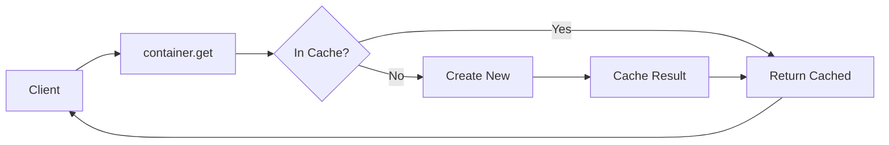

import { Callout, Tabs, Tab } from 'nextra/components'
import { unstable_TSDoc as TSDoc } from 'nextra/tsdoc'

# Container

The `Container` is the heart of the dependency injection (DI) system provided by ClaDI. It acts as a central registry and resolver for your application's dependencies (services, configurations, etc.).

Think of the container as a service locator or an inversion of control (IoC) container. Instead of components creating their dependencies, they ask the container for them using unique tokens (Symbols).

## Creating a Container

You typically create a container instance using the [`createContainer`](../../api-reference/key-exports) utility function.

```typescript filename="src/app.ts" copy
import { createContainer } from '@elsikora/cladi';

// Each container needs a unique Symbol name for potential global lookup
const appContainerName = Symbol.for('MyAppContainer');

const container = createContainer({ name: appContainerName });

// Now you can register and retrieve dependencies using 'container'
```

### Container Options (`IBaseContainerOptions`)

The [`createContainer`](../../api-reference/key-exports) function accepts an options object conforming to the [`IBaseContainerOptions`](../../api-reference/core-interfaces#ibasecontaineroptions) interface:

<TSDoc code={`import type { IBaseContainerOptions } from '@elsikora/cladi'; export default IBaseContainerOptions`} />

-   `name`: (Required) A unique `Symbol` identifying this container. This allows different parts of your application (or even different libraries) to potentially use isolated containers.
-   `logger`: (Optional) An instance conforming to the [`ILogger`](../../api-reference/core-interfaces#ilogger) interface (like one created with [`createLogger`](../../api-reference/key-exports)). If provided, the container will log its internal operations (registration, resolution, errors), which is extremely helpful for debugging.

```typescript filename="src/app-with-logging.ts" copy
import { createContainer, createLogger } from '@elsikora/cladi';

const containerLogger = createLogger({ source: 'AppContainer' });
const container = createContainer({
  name: Symbol.for('MyAppContainer'),
  logger: containerLogger,
});

containerLogger.info("Container created and configured with logging.");
```

## Core Operations

### Registration (`register` / `registerMany`)

You store dependencies in the container using `register` or `registerMany`, associating each dependency with a unique `Symbol` token.

<Callout>
  **Best Practice:** Define your tokens centrally (e.g., in a `tokens.ts` file) using `Symbol.for('YourUniqueTokenName')` to ensure uniqueness and easy referencing across your application.
</Callout>

There are three main ways to register dependencies:

<Tabs items={['Instance', 'Factory Function', 'Constructor (Decorators)']}>
  <Tab>
    Register a pre-existing instance directly. This is the simplest method when you already have the object configured.

    ```typescript filename="src/register-instance.ts" copy
    import { container, Tokens } from './container-setup'; // Assume container and tokens exist
    import { ApiConfig } from './config';

    const apiConfigInstance = new ApiConfig(/* ... */);
    // Register the already created instance
    container.register(Tokens.ApiConfig, apiConfigInstance);
    ```
  </Tab>
  <Tab>
    Register a function (`TContainerDynamicFactory`) that the container calls *the first time* the dependency is requested (`get`). The function receives context (including the container) and must return the instance. The result is cached (singleton scope).

    This is useful for complex setup logic or when the dependency's creation relies on other container-managed services.

    <TSDoc code={`import type { TContainerDynamicFactory, IContainerDynamicFactoryResolutionContext } from '@elsikora/cladi'; export type { TContainerDynamicFactory, IContainerDynamicFactoryResolutionContext }`} />

    ```typescript filename="src/register-factory.ts" copy
    import { container, Tokens } from './container-setup';
    import { ExternalService } from './services';
    import type { ApiConfig } from './config';
    import type { IContainerDynamicFactoryResolutionContext } from '@elsikora/cladi';

    container.register<ExternalService>(Tokens.ExternalService, (context: IContainerDynamicFactoryResolutionContext) => {
      // You can resolve other dependencies needed by the factory
      const apiConfig = context.container.get<ApiConfig>(Tokens.ApiConfig);
      console.log('ExternalService factory executed!'); // Only logs on first get()
      return new ExternalService(apiConfig.getServiceUrl());
    });

    // The factory function is only called ONCE when the first .get() occurs
    const service1 = container.get(Tokens.ExternalService);
    const service2 = container.get(Tokens.ExternalService); // Returns cached instance
    ```
    See the [Custom Providers guide](../../guides/custom-providers) for more details.
  </Tab>
  <Tab>
    Register a class constructor that has been decorated with [`@Injectable`](./decorators). The container will automatically instantiate the class and resolve *its* constructor dependencies (marked with [`@Inject`](./decorators)) when the dependency is first requested via `get`. The instance is then cached (singleton scope).

    This is often the cleanest approach for your own application services.

    ```typescript filename="src/register-constructor.ts" copy
    import { container, Tokens } from './container-setup';
    import { MyInjectableService } from './services'; // Assume this class uses @Injectable & @Inject

    // Register the constructor itself
    container.register<MyInjectableService>(Tokens.MyService, MyInjectableService);

    // When container.get(Tokens.MyService) is first called,
    // ClaDI will resolve dependencies and do: new MyInjectableService(...deps)
    ```
    See the [Decorators documentation](./decorators) for a full example.
  </Tab>
</Tabs>



### Retrieval (`get` / `getMany`)

You fetch dependencies using `get(token)` or `getMany([token1, token2])`. You *must* provide the correct type parameter `<T>` for type safety.

```typescript filename="src/retrieve-dependency.ts" copy
import { container, Tokens } from './container-setup';
import type { ILogger } from '@elsikora/cladi'; // Assuming ILogger is registered
import type { ApiConfig } from './config';

function loadConfig() {
  const logger = container.get<ILogger>(Tokens.Logger);
  const config = container.get<ApiConfig>(Tokens.ApiConfig);

  if (!logger || !config) {
    console.error('Required dependencies not found!');
    return;
  }

  logger.info('Configuration loaded', { context: { apiKeyPresent: !!config.getApiKey() } });
}
```

<Callout type="error">
  If a token is not registered or if resolution fails (e.g., a factory throws an error, or a decorated class dependency is missing), `get` will throw a [`BaseError`](../error-handling).
</Callout>

### Checking Existence (`has`)

Use `has(token)` to check if a token is registered before attempting retrieval, preventing potential errors.

```typescript filename="src/check-existence.ts" copy
import { container, Tokens } from './container-setup';

if (container.has(Tokens.OptionalService)) {
  const service = container.get(Tokens.OptionalService);
  // ... use optional service
} else {
  console.log('OptionalService not configured.');
}
```

### Unregistration (`unregister` / `unregisterMany`)

Remove dependencies from the container. This is less common in typical application flow but useful in testing or dynamic scenarios.

```typescript filename="src/unregister-example.ts" copy
import { container, Tokens } from './container-setup';

container.unregister(Tokens.ApiConfig);
console.log(`Has ApiConfig: ${container.has(Tokens.ApiConfig)}`); // false
```

### Clearing (`clear`)

Remove *all* registered dependencies. Primarily used for test environment teardown to ensure test isolation.

```typescript filename="src/clear-example.ts" copy
import { container, Tokens } from './container-setup';

// In a test teardown function (e.g., afterEach)
container.clear();
console.log(`Container has any dependencies: ${container.getAll().length > 0}`); // false
```

## Benefits Recap

-   **Loose Coupling:** Components depend on tokens/interfaces, not concrete implementations.
-   **Enhanced Testability:** Easily mock dependencies by registering mock implementations under the same tokens.
-   **Centralized Configuration:** Dependency creation and setup are managed centrally.
-   **Improved Maintainability:** Code becomes more modular and easier to refactor.

**Next:** [Decorators](./decorators) 