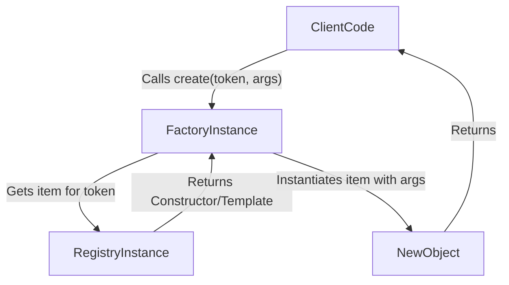

import { Callout } from 'nextra/components'
import { unstable_TSDoc as TSDoc } from 'nextra/tsdoc'

# Factory Pattern

The Factory pattern provides an interface for creating objects without specifying the exact class of object that will be created. In ClaDI, the `Factory` works in conjunction with a [`Registry`](./registry-pattern) to instantiate objects based on registered items (often constructors or templates).

ClaDI offers a `BaseFactory` implementation and a [`createFactory`](../../api-reference/key-exports) utility.

## Core Idea

1.  You register constructors (or template objects) in a [`Registry`](./registry-pattern) using unique tokens.
2.  You create a `Factory` instance, associating it with that `Registry`.
3.  When you need an object, you ask the `Factory` to `create` it using the token. The factory retrieves the corresponding constructor/template from the registry and instantiates the object, potentially passing arguments to the constructor.



## Creating a Factory

Use the [`createFactory`](../../api-reference/key-exports) utility. It requires a `registry` option.

```typescript filename="src/factory-setup.ts" copy
import { createFactory, createRegistry } from '@elsikora/cladi';

// Assume we have different document types
class Invoice { constructor(public id: number, public amount: number) {} }
class Receipt { constructor(public id: number, public items: string[]) {} }
class Report { constructor(public title: string, public data: any) {} }

// Define tokens
const DocumentTokens = {
  Invoice: Symbol.for('Doc::Invoice'),
  Receipt: Symbol.for('Doc::Receipt'),
  Report: Symbol.for('Doc::Report'),
};

// Create a registry to hold the constructors
const documentRegistry = createRegistry<typeof Invoice | typeof Receipt | typeof Report>();

documentRegistry.register(DocumentTokens.Invoice, Invoice);
documentRegistry.register(DocumentTokens.Receipt, Receipt);
documentRegistry.register(DocumentTokens.Report, Report);

// Create a factory linked to the registry
const documentFactory = createFactory({
  registry: documentRegistry,
});

export { documentFactory, DocumentTokens };
```

### Factory Options (`IBaseFactoryOptions`)

The [`createFactory`](../../api-reference/key-exports) requires an [options object](../../api-reference/core-interfaces#ibasefactoryoptions):

<TSDoc code={`import type { IBaseFactoryOptions } from '@elsikora/cladi'; export default IBaseFactoryOptions`} />

-   `registry`: (Required) The [`IRegistry`](../../api-reference/core-interfaces#iregistrylt T gt) instance containing the constructors or templates the factory will use.
-   `logger`: (Optional) An [`ILogger`](../../api-reference/core-interfaces#ilogger) instance for logging factory operations.
-   `creator`: (Optional) A custom function `(ctor, args) => instance` that gives you full control over instantiation. If provided, the factory calls this instead of `new Constructor(...args)`.

<Callout type="info">
  The `creator` option is less commonly needed with the basic `BaseFactory` but can be useful for more complex instantiation logic or when integrating with other systems.
</Callout>

## Core Operations

### Creating Instances (`create`)

The primary method is `create(token, ...constructorArguments)`. The factory looks up the `token` in its associated registry. If it finds a constructor, it instantiates it using `new Constructor(...constructorArguments)`. If it finds a non-function value (like a pre-configured object template), it returns that value directly (ignoring any `constructorArguments`).

```typescript filename="src/use-factory.ts" copy
import { documentFactory, DocumentTokens } from './factory-setup';

// Create an Invoice instance, passing arguments to its constructor
const invoice1 = documentFactory.create(DocumentTokens.Invoice, 101, 500.75);
console.log(invoice1); // Output: Invoice { id: 101, amount: 500.75 }

// Create a Receipt instance
const receipt1 = documentFactory.create(DocumentTokens.Receipt, 202, ['Item A', 'Item B']);
console.log(receipt1); // Output: Receipt { id: 202, items: [ 'Item A', 'Item B' ] }

// Create a Report instance
const report1 = documentFactory.create(DocumentTokens.Report, 'Q3 Summary', { sales: 12345 });
console.log(report1); // Output: Report { title: 'Q3 Summary', data: { sales: 12345 } }
```

<Callout type="error">
  If the token is not found in the associated registry, `create` will throw a [`BaseError`](./error-handling).
</Callout>

### Accessing the Registry (`getRegistry`)

You can get a reference to the underlying [`registry`](./registry-pattern) used by the factory if needed.

```typescript filename="src/access-registry.ts" copy
import { documentFactory } from './factory-setup';

const registry = documentFactory.getRegistry();
console.log(`Factory uses registry with ${registry.getAll().length} items.`);
```

## Use Cases

-   Decoupling object creation logic from the client code.
-   Creating different types of objects based on runtime conditions or configuration (by choosing different tokens).
-   Simplifying the creation of complex objects with multiple dependencies (though the [DI Container](../dependency-injection/container) is often more powerful for dependency *injection*).
-   Implementing plugin systems where different implementations (registered in the registry) can be created on demand.

**Next:** [Logging](./logging)